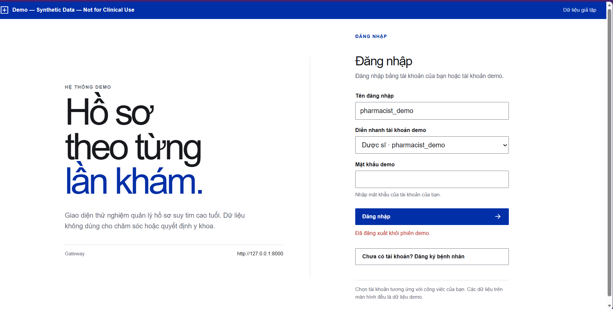
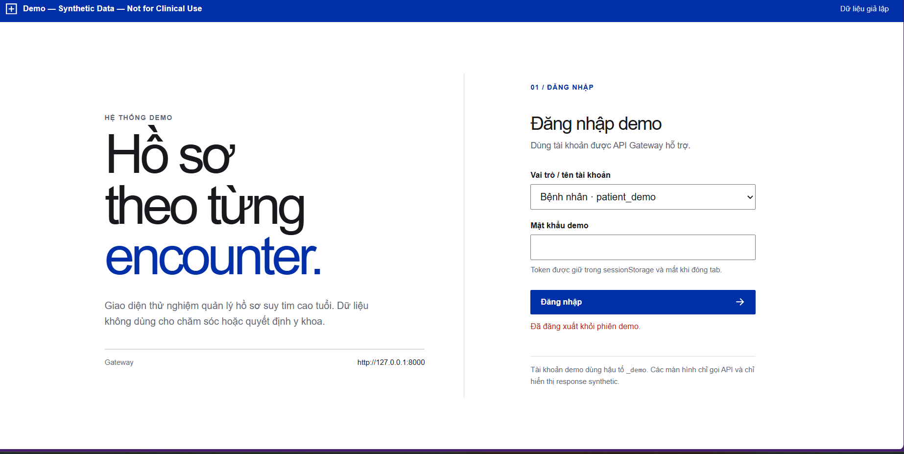
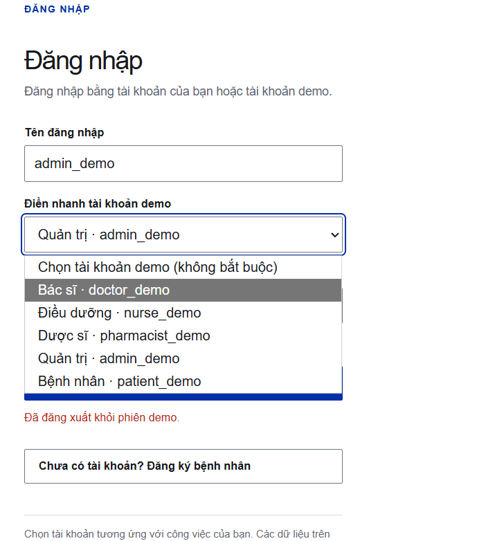
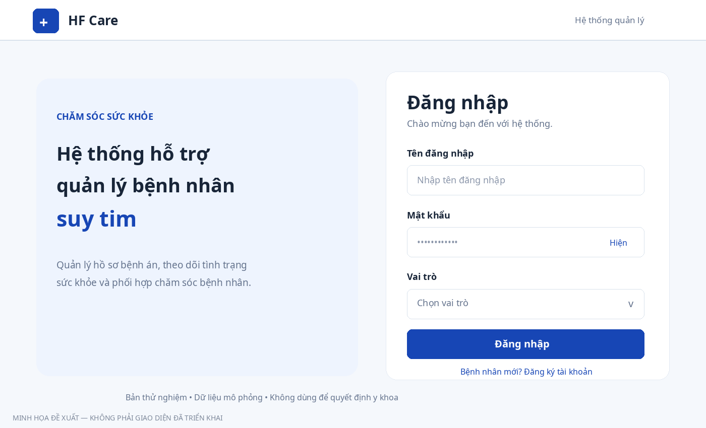

# REVIEW UI/UX – 01. Đăng nhập và điểm vào đăng ký bệnh nhân

**Dự án:** Hệ thống hỗ trợ quản lý bệnh nhân suy tim – Nhóm 27  
**Phiên bản đối chiếu:** ảnh phiên bản mới được nhóm trưởng cung cấp sau khi cập nhật GitHub ngày 08/10/2026  
**Phạm vi:** trang đăng nhập; lối vào đăng ký bệnh nhân (chưa kiểm thử form đăng ký)  
**Trạng thái tài liệu:** Bản review đang chỉnh sửa – nhóm trưởng cần xác nhận trước khi giao dev  
**Mức độ chứng cứ:** Ảnh chụp màn hình từ máy nhóm trưởng; logic backend tham chiếu code `src/gateway/routers/auth.py` trên repository nhóm.

> **Các yêu cầu nhóm trưởng đã thống nhất cho màn đăng nhập:** Form đăng nhập cần có **Tên đăng nhập – Mật khẩu – Vai trò**. **Bỏ hoàn toàn chọn nhanh tài khoản demo** và chữ “demo”/thuật ngữ kỹ thuật khỏi nội dung chính. **Chỉ bệnh nhân tự đăng ký**, tài khoản nhân viên y tế và quản trị do người có thẩm quyền cấp. Thông báo an toàn về dữ liệu giả lập/chưa sử dụng lâm sàng vẫn phải được giữ ở vị trí phù hợp.

## A. Review chi tiết theo từng mục (hình minh họa đặt ngay dưới nội dung liên quan)

### UI-01. Thay đổi cách giới thiệu sản phẩm

**HIỆN TẠI**  
Tiêu đề rất lớn: “Hồ sơ theo từng lần khám.”; mô tả: “Giao diện thử nghiệm quản lý hồ sơ suy tim cao tuổi.” Tên này thiên về một nghiệp vụ đơn lẻ, trong khi dự án có nhiều vai trò và nhiều luồng quản lý.

**Ảnh hiện tại – trang đăng nhập sau cập nhật:**

*Ảnh người dùng cung cấp trong buổi review ngày 08/10/2026.*

**ĐỀ XUẤT**

- **Tên ngắn tạm thời:** `HF Care` (tên minh họa, nhóm cần thống nhất tên chính thức).
- **Tiêu đề chính:** “Hệ thống hỗ trợ quản lý bệnh nhân suy tim”.
- **Mô tả:** “Quản lý hồ sơ bệnh án, theo dõi tình trạng sức khỏe và hỗ trợ phối hợp chăm sóc bệnh nhân suy tim cao tuổi.”
- Giảm diện tích chiếm chỗ của tiêu đề; đặt tên sản phẩm nhất quán trên trang đăng nhập, navbar và trong website.

**LÝ DO**  
Truyền đạt đúng phạm vi sản phẩm ngay khi truy cập; hạn chế thuật ngữ chuyên môn không cần thiết.

**ƯU TIÊN:** P1 – Cần sửa.  
**TIÊU CHÍ HOÀN THÀNH:** Trang đăng nhập hiển thị tên và mô tả đã được nhóm chốt, không còn lấy “Hồ sơ theo từng lần khám” làm định vị chính.

### UI-02. Thiết kế lại bố cục và khoảng trắng

**HIỆN TẠI**  
Hai cột trái–phải chưa cân đối. Cột trái dành nhiều diện tích cho tiêu đề quá lớn; form bên phải dài, xuất hiện thanh cuộn dọc ngay tại màn hình đăng nhập desktop trong ảnh.

**Ảnh đối chiếu – phiên bản trước khi cập nhật:**

*Bố cục hai cột được giữ lại qua các phiên bản; cần điều chỉnh tỷ lệ, kích thước chữ và không gian.*

**ĐỀ XUẤT**

- Giữ bố cục 2 cột trên desktop; tỉ lệ gợi ý 50–55% phần giới thiệu và 45–50% khu vực form.
- Căn giữa khối giới thiệu và form theo chiều dọc; đặt form trong card nền trắng, viền nhẹ, bo góc khoảng 12–16 px.
- Giảm cỡ tiêu đề; giới hạn chiều rộng dòng chữ để dễ đọc.
- Khoảng cách giữa các cụm trường nhập 16–20 px, không kéo giãn vô lý.
- Với màn hình nhỏ: ưu tiên form đăng nhập ở phía trên; phần giới thiệu thu gọn hoặc chuyển xuống dưới.
- Kiểm tra giao diện tại 1366×768, 1920×1080 và màn hình điện thoại; tránh cuộn không cần thiết do spacing.

**LÝ DO**  
Tăng khả năng tập trung vào thao tác chính và tạo bố cục nhất quán, dễ đọc.

**ƯU TIÊN:** P2 – Cải thiện.  
**TIÊU CHÍ HOÀN THÀNH:** Form và nội dung không bị cắt, xô lệch hay chồng lên nhau trên các kích thước được kiểm tra.

### UI-03. Thiết kế lại form đăng nhập (phương án nhóm trưởng đã thống nhất)

**HIỆN TẠI**  
Giao diện có `Tên đăng nhập` + `Điền nhanh tài khoản demo` + `Mật khẩu demo`. Danh sách tài khoản demo có thể khiến người dùng tưởng rằng họ phải chọn tài khoản/vai trò mới được đăng nhập. Mật khẩu được gọi là “mật khẩu demo” dù giao diện đã hỗ trợ tài khoản thường.

**Ảnh chi tiết – menu điền nhanh tài khoản cần thay:**

**ĐỀ XUẤT – FORM CHÍNH**

1. **Tên đăng nhập:** trường văn bản, để trống khi mở trang.
2. **Mật khẩu:** trường mật khẩu, thêm nút **Hiện / Ẩn**.
3. **Vai trò:** danh sách 5 mục: **Bác sĩ / Điều dưỡng / Dược sĩ / Bệnh nhân / Quản trị viên**. Nhãn rõ ràng, không dùng hậu tố `_demo` trong giao diện.
4. Nút chính **Đăng nhập**; một liên kết thứ cấp **Bạn là bệnh nhân mới? Đăng ký tài khoản**.
5. **Bỏ** hoàn toàn trường `Điền nhanh tài khoản demo` khỏi giao diện thường.

**Mockup minh họa giao diện đề xuất:**

*Đây là hình minh họa giao diện mong muốn, chưa phải website đã được triển khai. “HF Care” là tên tạm, nhóm chưa chốt tên chính thức.*

**RÀNG BUỘC NGHIỆP VỤ / BẢO MẬT**

- Vai trò chọn ở UI **không phải** quyền được cấp. Backend phải xác thực tài khoản/mật khẩu và đối chiếu vai trò đã chọn với quyền thật lưu trong database.
- Không được thay đổi quyền truy cập chỉ vì người dùng chọn “Quản trị viên” trong menu.
- Với tài khoản có đúng một vai trò, dev có thể đề xuất cơ chế tự xác định vai trò thay cho menu nếu nhóm thay đổi quyết định sau này; **hiện tại triển khai theo 3 trường đã chốt**.
- Sau khi xác thực thành công, điều hướng đến giao diện tương ứng với vai trò đã được xác nhận.
- Trong lúc gửi yêu cầu, nút nên hiển thị trạng thái “Đang đăng nhập…” và chống bấm lặp.
- Thông báo sai tài khoản/mật khẩu/vai trò bằng ngôn ngữ thân thiện, **không lộ thông tin nội bộ hay quyền của tài khoản khác**.

**LÝ DO**  
Chuyển từ màn hình thử tài khoản kỹ thuật sang quy trình đăng nhập chuẩn, đồng thời giúp người dùng nhận diện nhóm chức năng của mình.

**ƯU TIÊN:** P1 – Cần sửa.  
**TIÊU CHÍ HOÀN THÀNH:** Người dùng đăng nhập với 3 trường; không còn dropdown chọn tài khoản demo; chọn sai vai trò không thể nâng quyền; hiện/ẩn mật khẩu hoạt động; điều hướng đúng vai trò khi đăng nhập hợp lệ.

### UI-04. Loại bỏ nội dung kỹ thuật và nhãn demo

**HIỆN TẠI**  
Trên màn hình còn `HỆ THỐNG DEMO`, `Gateway http://127.0.0.1:8000`, `Demo — Synthetic Data — Not for Clinical Use`, `Mật khẩu demo`, hướng dẫn demo kỹ thuật.

**ĐỀ XUẤT**

| Nội dung đang có | Hướng thay đổi |
|---|---|
| `HỆ THỐNG DEMO` | Hiển thị tên sản phẩm hoặc “Hệ thống quản lý bệnh nhân” |
| `Gateway http://127.0.0.1:8000` | Ẩn khỏi UI người dùng, để trong công cụ kỹ thuật/dev |
| `Điền nhanh tài khoản demo` | Bỏ hoàn toàn khỏi form |
| `Mật khẩu demo` | Đổi thành “Mật khẩu” |
| `Synthetic API`, `response synthetic` | Không hiển thị trên màn hình nghiệp vụ |
| Banner demo lớn | Thay bằng một thông báo thử nghiệm/an toàn ngắn, bằng tiếng Việt |

**Không xóa hoàn toàn thông tin an toàn.** Cần giữ chú thích: “Hệ thống đang thử nghiệm với dữ liệu giả lập; không sử dụng để chẩn đoán, điều trị hoặc quyết định y khoa”, ở chân trang hoặc vị trí phù hợp, dễ tìm và dễ đọc.

**LÝ DO**  
Giao diện hướng đến người sử dụng cuối thay vì người lập trình, nhưng vẫn trung thực về giới hạn hệ thống.

**ƯU TIÊN:** P1.  
**TIÊU CHÍ HOÀN THÀNH:** Màn đăng nhập không còn endpoint, hostname, chế độ stub hoặc các nhãn demo kỹ thuật; thông báo thử nghiệm vẫn hiện rõ ràng.

### UI-05. Thống nhất hệ thống thiết kế (Design System)

**HIỆN TẠI**  
Giao diện có màu xanh–trắng nhưng thiếu bộ quy chuẩn chung cho font, kích thước, spacing và trạng thái tương tác.

**ĐỀ XUẤT**

| Thành phần | Gợi ý |
|---|---|
| Primary | `#1746B5` |
| Background | `#F5F8FC` |
| Text | `#182538` |
| Accent | `#0F8B8D` |
| Font | Inter hoặc Be Vietnam Pro |
| Cỡ chữ nội dung chính | Ưu tiên ≥ 16 px |
| Line-height | Khoảng 1.4–1.6 |
| Chiều cao input/button | 44–48 px trở lên |
| Border radius card | Khoảng 12–16 px |

- Thống nhất trạng thái hover, focus, disabled, loading, error, success.
- Kiểm tra độ tương phản và khả năng thao tác bằng bàn phím, đặc biệt vì sản phẩm có người dùng cao tuổi.
- Không làm UI quá phụ thuộc vào hiệu ứng hay icon trang trí.

**ƯU TIÊN:** P2.  
**TIÊU CHÍ HOÀN THÀNH:** Các nút, trường nhập, nhãn và thông báo tuân theo cùng bộ style trên toàn màn hình; màu focus và lỗi phân biệt được.

### UI-06. Chuẩn hóa thông báo và trạng thái

**HIỆN TẠI**  
“Đã đăng xuất khỏi phiên demo” đang hiển thị màu đỏ như thông báo lỗi, dù đăng xuất thành công.

**ĐỀ XUẤT**

- Đăng xuất thành công: “Bạn đã đăng xuất.”, màu trung tính hoặc success; có thể tự ẩn sau vài giây.
- Sai tài khoản/mật khẩu: thông báo lỗi dễ hiểu, không hiện tên endpoint hay stack trace.
- Bỏ trống trường: thông báo ngay dưới trường liên quan.
- Khi kết nối server lỗi: thông báo thân thiện, có nút thử lại khi phù hợp.

**LÝ DO**  
Trạng thái UI phải phản ánh đúng điều vừa xảy ra và hướng dẫn người dùng khắc phục.

**ƯU TIÊN:** P2.  
**TIÊU CHÍ HOÀN THÀNH:** Không dùng màu lỗi cho trạng thái thành công; lỗi đăng nhập hiển thị và có thể khắc phục được.

### UI-14. Lối vào đăng ký tài khoản: **chỉ dành cho bệnh nhân**

**HIỆN TẠI**  
Đã có liên kết “Chưa có tài khoản? Đăng ký bệnh nhân”. Chưa có ảnh/kiểm thử màn hình đăng ký trong vòng review này.

**ĐỀ XUẤT / QUY ĐỊNH NGHIỆP VỤ**

| Nhóm người dùng | Cách cấp tài khoản |
|---|---|
| Bệnh nhân | Có thể tự đăng ký qua website |
| Bác sĩ | Tài khoản do quản trị viên/người có thẩm quyền cấp |
| Điều dưỡng | Tài khoản do quản trị viên/người có thẩm quyền cấp |
| Dược sĩ | Tài khoản do quản trị viên/người có thẩm quyền cấp |
| Quản trị viên | Cấp riêng, không cho tự đăng ký công khai |

- Luồng đăng ký chỉ tạo quyền bệnh nhân; không cho tự tạo tài khoản nhân viên.
- Tài khoản tự đăng ký **không được tự động xem hồ sơ bệnh án đã tồn tại** nếu chưa xác minh/liên kết phù hợp.
- **Cần xác minh với dev:** Theo tài liệu/code hiện tại, đăng ký tạo một hồ sơ bệnh nhân giả lập **mới** và gắn bác sĩ demo mặc định. Cần thống nhất đây là hành vi có chủ đích ở giai đoạn đồ án hay sẽ cần quy trình gắn hồ sơ thật trong phạm vi tương lai.
- Phải review riêng form đăng ký và thông báo kết quả khi nhóm trưởng cung cấp màn hình.

**ƯU TIÊN:** P1 cho quy tắc phân quyền; phần UI form chờ kiểm thử.  
**TIÊU CHÍ HOÀN THÀNH:** Tài khoản đăng ký mới chỉ có quyền bệnh nhân; không có đăng ký công khai các vai trò nội bộ; hồ sơ khác không truy cập được trái phép.

### AUTH-01. Tài khoản kiểm thử và mật khẩu

**Ý KIẾN NHÓM TRƯỞNG**  
Muốn thao tác nhanh khi thuyết trình, đã đề xuất dùng mật khẩu dễ nhớ `12345678`.

**ĐỀ XUẤT XỬ LÝ**  
Không dùng `12345678` cho tài khoản thật hoặc hệ thống công khai vì quá yếu. Nếu cần demo, chuẩn bị tài khoản thử nghiệm cấp trước với mật khẩu đủ mạnh, dễ nhập; cung cấp riêng cho người test. Không hạ yêu cầu bảo mật đăng ký toàn hệ thống chỉ để thuận tiện demo.

**TRẠNG THÁI:** Cần nhóm trưởng và dev chốt; không mặc định đây là yêu cầu thay đổi bảo mật đã phê duyệt.

---

## B. Checklist nghiệm thu sau khi dev sửa

- [ ] Tên sản phẩm và đoạn giới thiệu đúng nội dung được nhóm chốt.
- [ ] Form hiển thị **Tên đăng nhập – Mật khẩu – Vai trò**; không có “điền nhanh demo”.
- [ ] Username/mật khẩu không tự điền mặc định khi vào trang (trừ chức năng tự điền chuẩn của trình duyệt, nếu người dùng bật).
- [ ] Vai trò hiển thị đúng 5 lựa chọn, được backend kiểm tra với quyền tài khoản.
- [ ] Sai mật khẩu/sai vai trò không đăng nhập được và không tiết lộ thông tin nhạy cảm.
- [ ] Có hiển thị/ẩn mật khẩu, trạng thái loading và thông báo lỗi hợp lý.
- [ ] Chỉ bệnh nhân được tự đăng ký; tài khoản nhân viên do quản trị cấp.
- [ ] Không còn `Gateway`, `stub`, `synthetic API`, `_demo` hiển thị trong nội dung nghiệp vụ.
- [ ] Vẫn có cảnh báo rõ về dữ liệu mô phỏng và giới hạn dùng cho lâm sàng.
- [ ] Bố cục phù hợp desktop và mobile; dùng được bàn phím.

## C. Bảng theo dõi

| Mã | Mô tả ngắn | Ưu tiên | Trạng thái hiện tại |
|---|---|---|---|
| UI-01 | Tên sản phẩm và lời giới thiệu | P1 | Đã đổi một phần; cần chỉnh tiếp |
| UI-02 | Bố cục hai cột và khoảng trắng | P2 | Chưa đạt |
| UI-03 | Form có username + password + role, bỏ demo selector | P1 | Chưa đạt |
| UI-04 | Loại bỏ thuật ngữ kỹ thuật; giữ thông báo an toàn | P1 | Chưa đạt |
| UI-05 | Design System | P2 | Cần hoàn thiện |
| UI-06 | Trạng thái thông báo | P2 | Chưa đạt |
| UI-14 | Đăng ký chỉ dành cho bệnh nhân | P1 | Phân quyền cần kiểm thử; màn đăng ký chưa review |
| AUTH-01 | Mật khẩu/tài khoản dùng để test | Cần chốt | Chưa quyết định |

## D. Tài liệu tham khảo

- Mã nguồn và tài liệu dự án: [GitHub – Nhóm 27](https://github.com/tnhh175/suytim_clone_demo/tree/main/submissions/suy_tim_nhom27)
- [OpenMRS](https://openmrs.org/demo/) – Tham khảo cách sản phẩm y tế tổ chức đăng nhập.
- [MyChart](https://www.mychart.org/) – Tham khảo cổng bệnh nhân.
- [NHS App Design System](https://design-system.nhsapp.service.nhs.uk/) – Tham khảo biểu mẫu, ngôn ngữ và thiết kế dễ tiếp cận.

**Lưu ý về trạng thái:** Dashboard bác sĩ chưa được nhóm trưởng chốt và **không nằm trong tài liệu này**.

**Ghi chú quản lý thay đổi:** Đây là tài liệu review, không phải kết quả xác nhận dev đã sửa. Sau bản cập nhật tiếp theo, nhóm trưởng nên đối chiếu từng checkbox và cập nhật cột trạng thái.
