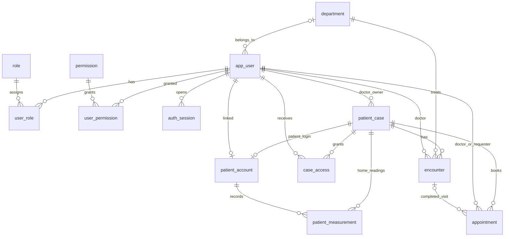
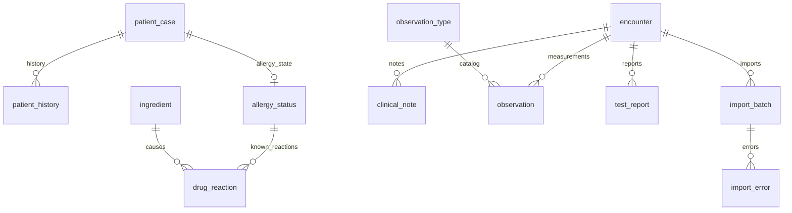
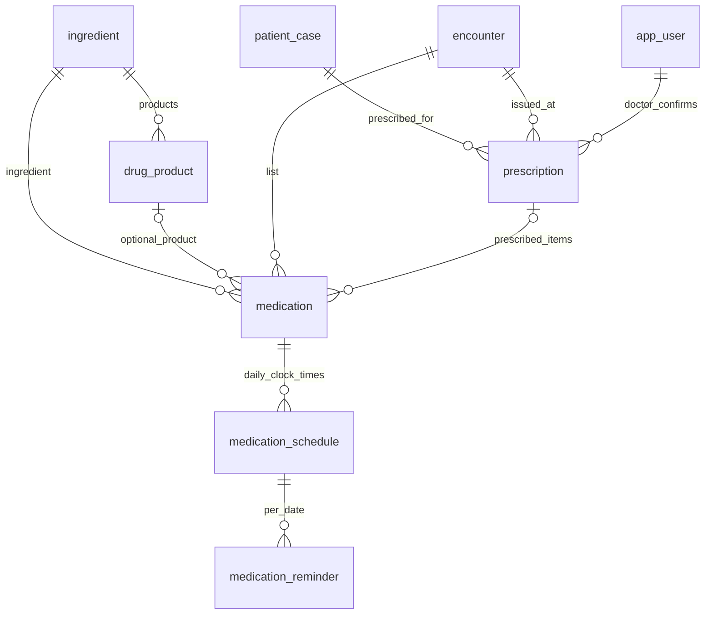
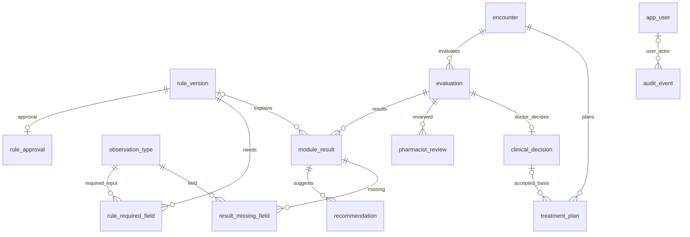

# ERD — mô hình cập nhật theo SRS và cổng bệnh nhân

Schema hiện tại có **39 bảng**. Các sơ đồ Mermaid dưới đây chia theo nghiệp vụ; một thực thể xuất hiện lại vẫn là cùng bảng. Danh sách đầy đủ cột, FK, CHECK, index, trigger và RLS nằm trong [metadata](schema_metadata.json) và [từ điển dữ liệu](data_dictionary.md). Các ảnh ERD PNG tuần 3 mô tả phiên bản 18 bảng cũ, không phản ánh phần mở rộng này.

## Tài khoản, hồ sơ, lần khám và bệnh nhân

`patient_account` có UNIQUE trên hồ sơ và PK trên tài khoản; FK đến vai trò `patient`. Tài khoản bệnh nhân không được gán vai trò nhân viên. Lịch hẹn có UNIQUE có điều kiện cho `(doctor_id, slot_at)` và `(case_id, slot_at)` khi còn chờ/xác nhận. Chỉ số tự nhập thuộc hồ sơ, tách khỏi số liệu theo lần khám.

## Dữ liệu lâm sàng và nguồn nhập

Ghi chú phân loại chăm sóc, khám, chẩn đoán và lão khoa. Dị ứng phân biệt `unknown`, `none`, `known`. Từng giá trị observation có loại/status/nguồn/thời điểm và liên kết người ghi; đơn vị chuẩn thuộc catalog. Mọi bảng này tham chiếu nhân viên ghi dữ liệu, không thể nhận UUID người dùng không tồn tại.

## Đơn thuốc, giờ uống và nhắc uống

FK ghép giữ đúng hoạt chất/sản phẩm và đơn/lần khám/hồ sơ. Giờ uống nằm ở thuốc trong đơn; số giờ phải bằng tần suất trước xác nhận. Múi giờ và khoảng ngày ở đơn/thuốc quyết định `due_at`. UNIQUE `(schedule_id, scheduled_on)` chống nhắc trùng. Đơn xác nhận giữ bất biến; hủy đơn hủy nhắc đang chờ.

## Quy tắc, đánh giá và quyết định

Phê duyệt yêu cầu quyền riêng và hash của nội dung đã tested. Snapshot đánh giá, quyết định và audit bất biến. Kế hoạch liên kết quyết định được chấp nhận/điều chỉnh của đúng lần khám khi dùng kết quả hỗ trợ; bác sĩ cũng có thể nhập kế hoạch độc lập. Seed chỉ tạo kết quả stub và rule draft, không tự sinh đơn từ gợi ý.

RLS của cổng bệnh nhân và luồng SQL mẫu được mô tả trong [README database](README.md). Gateway ứng dụng hiện tại chưa nối PostgreSQL.
