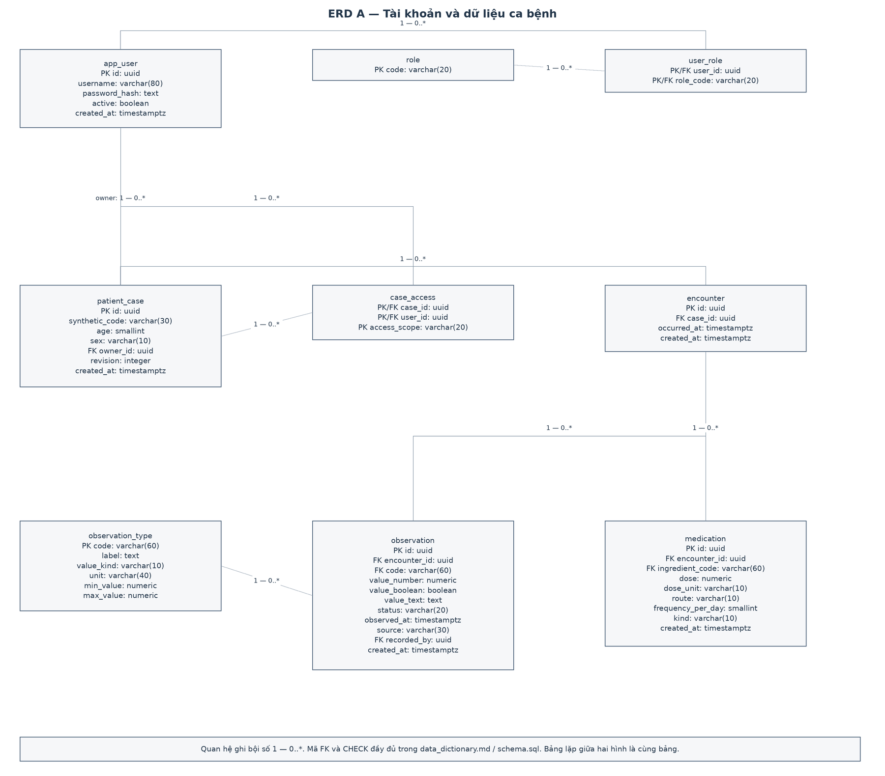
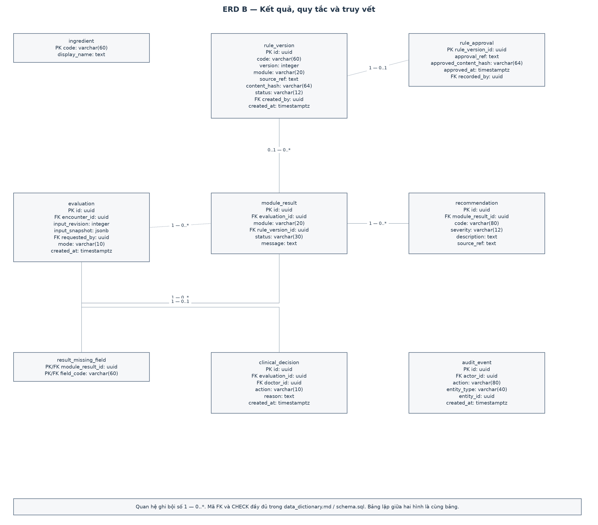
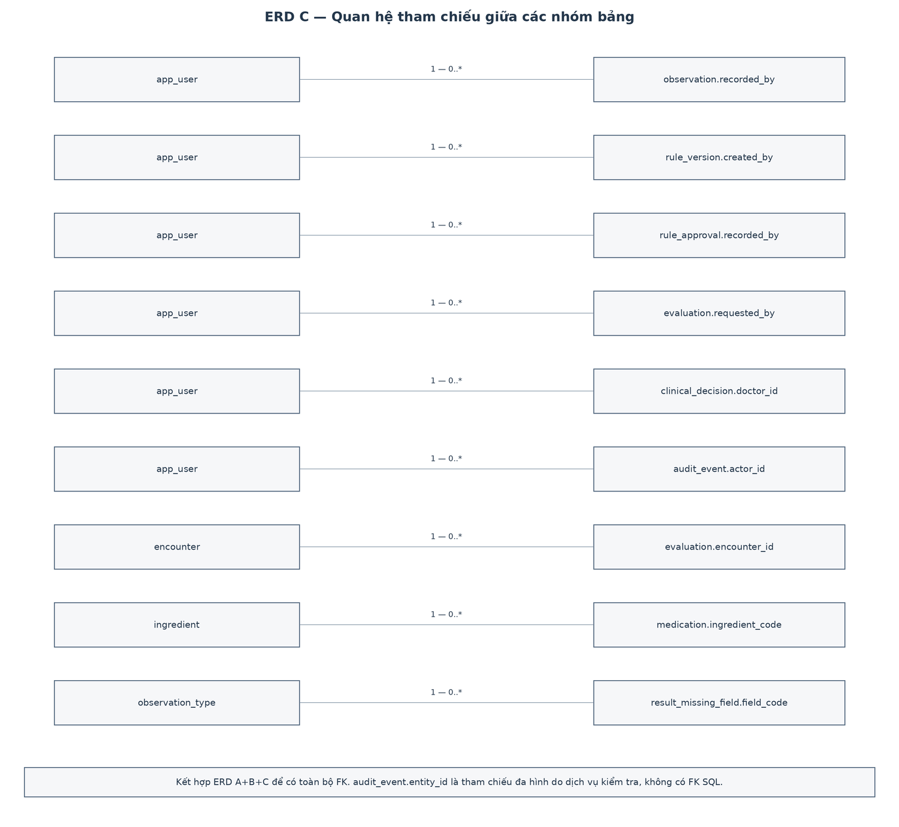

# ERD — mô hình quan hệ

Mô hình có 18 bảng, chia thành ba góc nhìn để đọc được tên trường. A và B chứa đầy đủ bảng/cột; C nối các tham chiếu giữa hai nhóm. Một bảng xuất hiện lại vẫn là cùng thực thể. Bội số `1 — 0..*` nghĩa là mỗi bản ghi con trỏ về đúng một bản ghi cha, còn cha có thể chưa có bản ghi con.

Các bảng liên kết user_role, case_access, result_missing_field dùng khóa chính ghép. rule_approval và clinical_decision giới hạn tối đa một bản ghi cho mỗi phiên bản/lần đánh giá. `module_result.rule_version_id` được null trong stub; đánh giá thật phải gắn phiên bản.

Thiết kế 3NF của phần quan hệ, CHECK, index và ngoại lệ snapshot JSON được giải thích trong [data_dictionary.md](data_dictionary.md). Chưa thêm người dùng bệnh nhân hoặc điều dưỡng.
