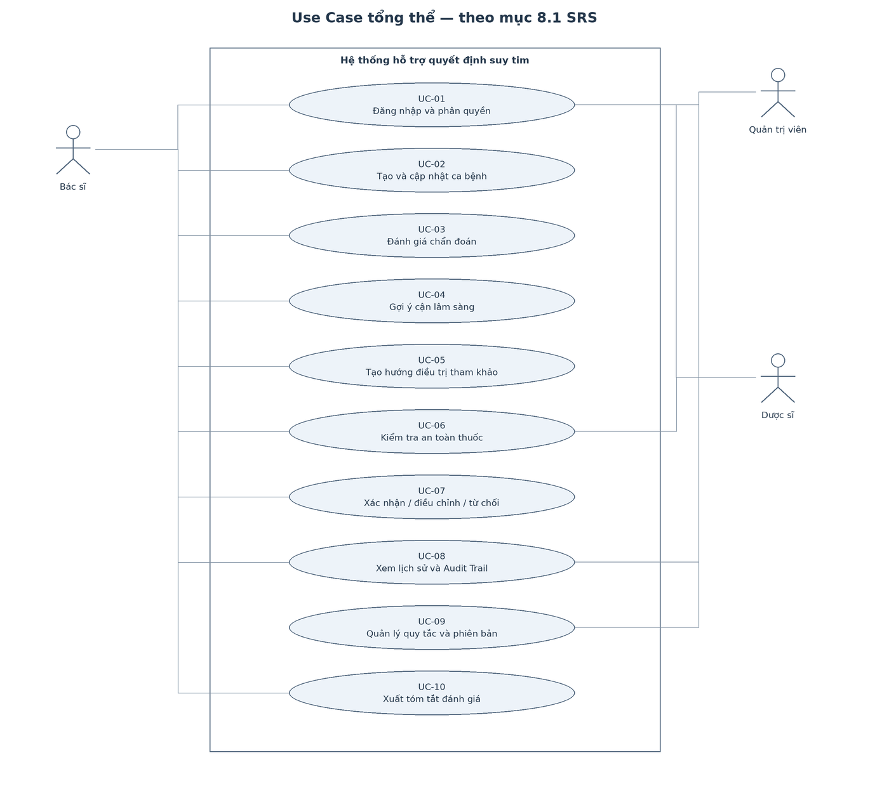
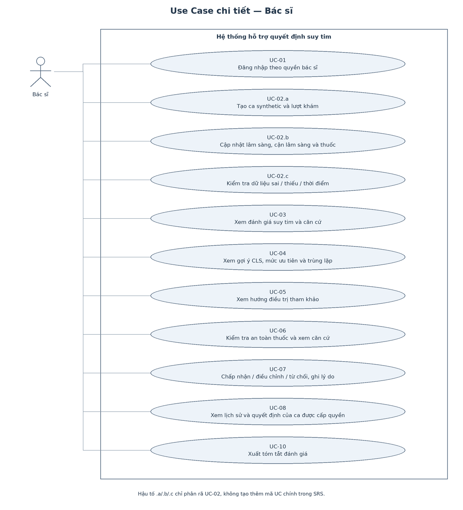
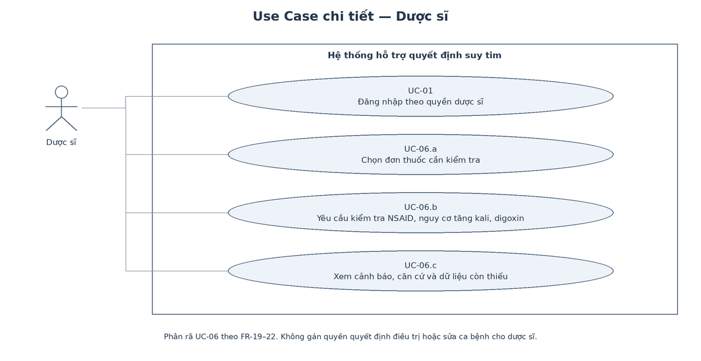
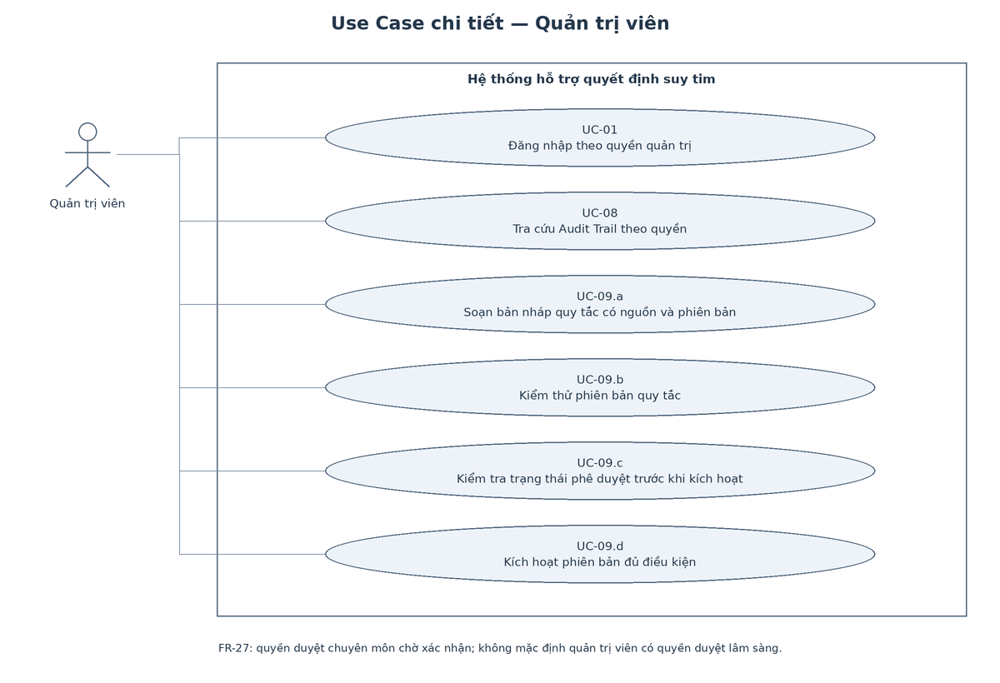
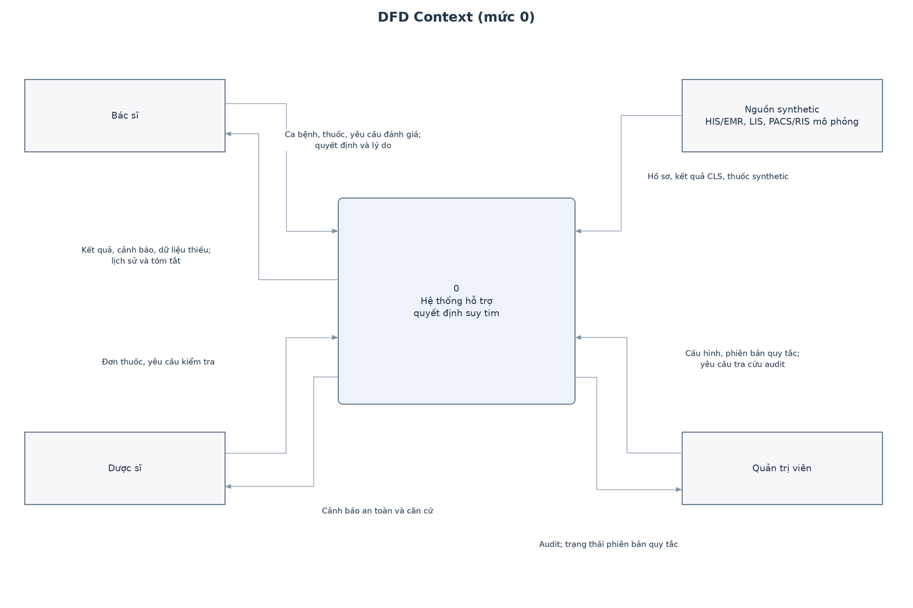
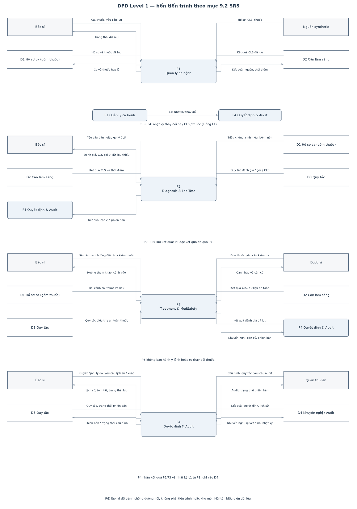

# SRS v1.0 — Hệ thống quản lý bệnh nhân suy tim cao tuổi

- **Môn học:** Kỹ thuật Phần mềm Ứng dụng
- **Trạng thái:** Bản review Tuần 2
- **Chuẩn tham chiếu:** IEEE 830 / ISO/IEC/IEEE 29148
- **Nhóm:** nhom27

## 1. Giới thiệu

### 1.1. Mục đích

Tài liệu đặc tả yêu cầu cho hệ thống hỗ trợ bác sĩ đánh giá và quản lý
quyết định lâm sàng liên quan đến suy tim ở người cao tuổi. Hệ thống
tổng hợp dữ liệu, đưa ra gợi ý có căn cứ và ghi nhận phản hồi của bác sĩ.
Hệ thống không tự ban hành chẩn đoán, y lệnh hoặc thay đổi thuốc.
Bác sĩ quyết định việc áp dụng các gợi ý.

### 1.2. Phạm vi MVP

MVP gồm bốn phân hệ:

1. **Diagnosis:** kiểm tra dữ liệu, phân loại kiểu hình theo EF và nêu dữ liệu còn thiếu.
2. **Lab/Test:** gợi ý cận lâm sàng còn thiếu, xếp mức ưu tiên và tránh gợi ý trùng.
3. **Treatment:** đưa ra hướng điều trị tham khảo theo kiểu hình và khả năng dung nạp.
4. **MedSafety:** kiểm tra đơn thuốc, tập trung vào cảnh báo NSAID và nguy cơ tăng kali khi phối hợp ARNI/ACEI với MRA.

Ngoài phạm vi MVP: Bản demo hiện được nhóm đề xuất sử dụng dữ liệu synthetic và nguồn
HIS/EMR mô phỏng. Mức tích hợp thực tế, yêu cầu sử dụng ML/LLM và
phạm vi đầu ra của từng phân hệ đang chờ xác nhận.
Hệ thống không tự ban hành y lệnh, tự thay đổi thuốc hoặc thay thế
quyết định chuyên môn của bác sĩ.

### 1.3. Thuật ngữ

| Thuật ngữ | Ý nghĩa |
|---|---|
| CDSS | Clinical Decision Support System |
| EF | Phân suất tống máu thất trái |
| HFrEF | Suy tim EF giảm, EF ≤40% |
| HFmrEF | Suy tim EF giảm nhẹ, EF 41–49% |
| HFpEF | Suy tim EF bảo tồn, EF ≥50% |
| PII/PHI | Dữ liệu nhận diện/cá nhân và dữ liệu sức khỏe nhạy cảm |
| Rule version | Phiên bản bất biến của bộ quy tắc được dùng tại thời điểm đánh giá |

### 1.4. Tài liệu tham chiếu

- Bộ Y tế, *Hướng dẫn chẩn đoán và điều trị suy tim cấp và mạn*, 2022.
- Bệnh viện Hữu Nghị, *Tổng hợp các khuyến cáo về suy tim ở người cao tuổi*.
- Tài liệu `SUY TIM.docx` mô tả input/output cho bốn module AI-CDSS.
- Schema tối thiểu AI-CDSS và bảng biến giao diện bác sĩ — phần suy tim.
- Bài giảng KTPMUD Chương 1, Chương 2 và hướng dẫn Sprint 1 Tuần 2–3.

## 2. Mô tả tổng quan

### 2.1. Problem Statement

Dữ liệu suy tim cao tuổi nằm ở nhiều nhóm: triệu chứng, sinh hiệu, xét nghiệm, chẩn đoán hình ảnh, bệnh đồng mắc, đánh giá lão khoa và thuốc. Việc rà soát thủ công dễ bỏ sót dữ liệu thiếu, nhầm nhánh đánh giá theo EF hoặc bỏ qua cảnh báo thuốc. Nhóm cần một hệ thống tập hợp dữ liệu, chạy các quy tắc có phiên bản và trình bày căn cứ để bác sĩ kiểm tra.

### 2.2. Customer và End-user

| Nhóm | Vai trò |
|---|---|
| Customer | Giảng viên/chuyên gia cung cấp yêu cầu, xác nhận phạm vi, rule, ngưỡng và tiêu chí nghiệm thu. |
| End-user chính | Bác sĩ nhập ca bệnh, xem và quyết định với khuyến nghị. |
| End-user phụ | Dược sĩ rà soát thuốc; quản trị viên quản lý quyền, rule version và audit. |

### 2.3. Ràng buộc và giả định

- Chỉ dùng dữ liệu synthetic trong đồ án.
- Rule lâm sàng phải có nguồn, phiên bản và người duyệt.
- Ngưỡng chưa được xác nhận phải để cấu hình và gắn trạng thái `pending_review`.
- Nếu dùng quy tắc chưa duyệt để minh họa trong môi trường thử nghiệm, đầu ra phải ghi rõ trạng thái thử nghiệm.
- Hệ thống phải trả `Chưa đủ dữ liệu` thay vì tự suy đoán.
- Trạng thái thiếu dữ liệu được xác định theo từng quyết định; một phần thiếu dữ liệu không mặc định làm dừng toàn bộ hệ thống.
- Bác sĩ có quyền chấp nhận, điều chỉnh hoặc từ chối và phải ghi lý do khi cần.

### 2.4. Giao diện ngoài

- **UI:** định hướng hiển thị gợi ý trong màn hình bệnh án điện tử dưới dạng Smart Panel. Bản demo dự kiến mô phỏng môi trường này; mức tích hợp thực tế chờ xác nhận.
- **Nguồn dữ liệu:** HIS/EMR, LIS, PACS/RIS theo phạm vi được thống nhất.Trong bản demo, các nguồn có thể được mô phỏng bằng dữ liệu synthetic, biểu mẫu hoặc mock service.
- **API:** REST/JSON qua API Gateway; OpenAPI được thiết kế ở Tuần 3.
- **Bảo mật:** HTTPS khi triển khai, RBAC, mật khẩu băm, không ghi PII vào log.

## 3. Yêu cầu nghiệp vụ và người dùng

### 3.1. Business Requirements

| ID | Yêu cầu |
|---|---|
| BR-01 | Chuẩn hóa quy trình đánh giá ca suy tim cao tuổi trên một giao diện. |
| BR-02 | Giảm nguy cơ bỏ sót dữ liệu và cảnh báo an toàn thuốc cốt lõi. |
| BR-03 | Khuyến nghị phải giải thích được và do bác sĩ kiểm soát. |
| BR-04 | Thực hiện Zero PII/PHI trong đồ án. |
| BR-05 | Tạo nền tảng mở rộng bốn module Diagnosis, Lab/Test, Treatment, MedSafety. |

### 3.2. User Requirements

| ID | Actor | Nhu cầu |
|---|---|---|
| UR-01 | Bác sĩ | Tạo và cập nhật ca bệnh synthetic. |
| UR-02 | Bác sĩ | Biết trường nào thiếu, sai hoặc quá cũ. |
| UR-03 | Bác sĩ | Nhận phân loại kiểu hình/bệnh cảnh kèm căn cứ. |
| UR-04 | Bác sĩ | Nhận gợi ý cận lâm sàng còn thiếu theo mức ưu tiên. |
| UR-05 | Bác sĩ | Xem hướng điều trị tham khảo theo kiểu hình và khả năng dung nạp. |
| UR-06 | Bác sĩ/Dược sĩ | Kiểm tra đơn thuốc và nhận cảnh báo có mức độ. |
| UR-07 | Bác sĩ | Xác nhận, điều chỉnh hoặc từ chối và ghi lý do. |
| UR-08 | Quản trị | Quản lý quyền, rule version và Audit Trail. |

## 4. Yêu cầu chức năng

| ID | Module | Yêu cầu | Ưu tiên |
|---|---|---|---|
| FR-01 | Tài khoản | Đăng nhập và phân quyền Bác sĩ, Dược sĩ, Quản trị viên. | Must |
| FR-02 | Ca bệnh | Tạo ca bằng mã synthetic và mã lượt khám. | Must |
| FR-03 | Ca bệnh | Nhập/sửa triệu chứng, dấu hiệu, sinh hiệu, bệnh đồng mắc và đánh giá lão khoa. | Must |
| FR-04 | Dữ liệu | Kiểm tra kiểu, đơn vị, miền giá trị hợp lệ và thời điểm. Phân biệt dữ liệu không hợp lệ với dữ liệu hợp lệ nhưng bất thường; biểu diễn rõ trạng thái chưa có/chưa đánh giá. | Must |
| FR-05 | Dữ liệu | Ghi nhận xét nghiệm và chẩn đoán hình ảnh kèm đơn vị, thời điểm, nguồn. | Must |
| FR-06 | Thuốc | Ghi nhận thuốc hiện tại và đơn mới theo hoạt chất, liều, đường dùng, tần suất. | Must |
| FR-07 | Dữ liệu | Hiển thị dữ liệu thiếu theo mục tiêu; không đổi giá trị thiếu thành 0. | Must |
| FR-08 | Diagnosis | Hỗ trợ đánh giá kiểu hình suy tim khi có đủ căn cứ theo quy tắc đã duyệt. Nếu thiếu căn cứ, nêu rõ phần chưa đánh giá được.| Must |
| FR-09 | Diagnosis | Ước tính Stage A–D khi đủ tiêu chí đã duyệt. | Should |
| FR-10 | Diagnosis | Phân loại mới khởi phát, mạn ổn định, worsening hoặc mất bù theo rule. | Should |
| FR-11 | Diagnosis | Phát hiện dữ liệu gợi ý cấp cứu và yêu cầu bác sĩ đánh giá ngay. | Must |
| FR-12 | Diagnosis | Cảnh báo bệnh giả suy tim hoặc nguyên nhân cần phân biệt. | Should |
| FR-13 | Lab/Test | Gợi ý BNP/NT-proBNP, ECG, siêu âm, X-quang và xét nghiệm máu còn thiếu. | Must |
| FR-14 | Lab/Test | Xếp mức ưu tiên cấp cứu/24 giờ/đợt khám/định kỳ. | Should |
| FR-15 | Lab/Test | Cảnh báo xét nghiệm trùng trong cửa sổ thời gian cấu hình. | Should |
| FR-16 | Treatment | Chọn Strategy tham khảo theo HFrEF, HFmrEF hoặc HFpEF. | Must |
| FR-17 | Treatment | Hiển thị bốn nhóm thuốc nền tảng để bác sĩ đánh giá ở HFrEF. | Must |
| FR-18 | Treatment | Gợi ý xem xét lợi tiểu khi sung huyết; không tự kê đơn. | Must |
| FR-19 | MedSafety | Phát hiện thuốc thuộc danh mục NSAID cần cảnh báo theo quy tắc đã duyệt; nêu hoạt chất, lý do và mức cảnh báo. | Must |
| FR-20 | MedSafety | Cảnh báo vàng khi ARNI/ACEI phối hợp MRA và có nguy cơ tăng kali theo rule. | Must |
| FR-21 | MedSafety | Cảnh báo nguy cơ digoxin khi suy thận, nhịp chậm hoặc điều kiện cấu hình. | Could |
| FR-22 | Giải thích | Hiển thị input kích hoạt, căn cứ, mức cảnh báo và rule version. | Must |
| FR-23 | Quyết định | Cho bác sĩ chấp nhận, điều chỉnh hoặc từ chối và nhập lý do. | Must |
| FR-24 | Audit | Lưu mã ca/lượt khám, mã lần đánh giá, tham chiếu phiên bản dữ liệu đầu vào, phiên bản quy tắc, khuyến nghị và quyết định; kèm người thao tác, thời điểm và lý do khi có. | Must |
| FR-25 | Lịch sử | Xem lại các lần đánh giá và quyết định trước của cùng ca. | Should |
| FR-26 | Báo cáo | Xuất tóm tắt không chứa PII/PHI thật. | Could |
|FR-27  | Quản trị quy tắc | Hỗ trợ vòng đời quy tắc: nháp, kiểm thử, phê duyệt và kích hoạt. Quyền soạn, duyệt và kích hoạt thực hiện theo phân quyền được xác nhận; không mặc định quản trị kỹ thuật có quyền duyệt chuyên môn. | Should |

## 5. Yêu cầu phi chức năng theo ISO 25010

| ID | Thuộc tính | Tiêu chí định lượng | Xác minh |
|---|---|---|---|
| NFR-01 | Hiệu năng | Rule cảnh báo lõi p95 ≤200 ms/100 lượt gọi trên môi trường demo. | Performance test |
| NFR-02 | Hiệu năng | Một lần đánh giá đầy đủ ≤10 giây/ca. | API test |
| NFR-03 | Tin cậy | Cùng input + rule version cho cùng output trong 100/100 lần. | Repeat test |
| NFR-04 | Tính đúng | Rule EF, NSAID, tăng kali đạt 100% gold cases đã duyệt. | Integration test |
| NFR-05 | Sẵn sàng | Mục tiêu deploy ≥99,9%; MVP mô phỏng health check. | Monitoring |
| NFR-06 | Bảo mật | HTTPS; dữ liệu lưu mã hóa AES-256 khi môi trường hỗ trợ. | Config test |
| NFR-07 | Bảo mật | RBAC, mật khẩu băm, chặn 100% ca truy cập trái quyền trong bộ test. | Security test |
| NFR-08 | Riêng tư | 0 PII thật trong repo, log và dữ liệu test. | CI scan |
| NFR-09 | Truy vết | 100% khuyến nghị và quyết định có Audit Trail. | Data reconciliation |
| NFR-10 | Khả dụng | Nhập ca mẫu ≤5 phút sau hướng dẫn ngắn. | Usability test |
| NFR-11 | Bảo trì | Core Rule Engine có unit-test coverage ≥80%; rule tách UI. | Coverage report |
| NFR-12 | Tương thích | Hỗ trợ hai phiên bản mới nhất của Chrome và Edge. | Browser test |

## 6. Product Backlog và INVEST

| ID | User Story | FR |
|---|---|---|
| US-01 | Là bác sĩ, tôi muốn tạo ca synthetic để không dùng PII thật. | FR-02 |
| US-02 | Là bác sĩ, tôi muốn nhập và kiểm tra dữ liệu để biết trường sai. | FR-03–07 |
| US-03 | Là bác sĩ, tôi muốn xem nhóm EF và mức độ đầy đủ của bằng chứng để không nhầm phân nhóm EF với kết luận suy tim. | FR-08 |
| US-04 | Là bác sĩ, tôi muốn nhận trạng thái chưa đủ dữ liệu. | FR-07–12 |
| US-05 | Là bác sĩ, tôi muốn nhận gợi ý cận lâm sàng theo mức ưu tiên. | FR-13–15 |
| US-06 | Là bác sĩ, tôi muốn xem hướng điều trị tham khảo theo kiểu hình. | FR-16–18 |
| US-07 | Là bác sĩ/dược sĩ, tôi muốn cảnh báo đỏ khi có NSAID. | FR-19 |
| US-08 | Là bác sĩ/dược sĩ, tôi muốn cảnh báo nguy cơ tăng kali. | FR-20–21 |
| US-09 | Là bác sĩ, tôi muốn xem căn cứ của khuyến nghị. | FR-22 |
| US-10 | Là bác sĩ, tôi muốn xác nhận/từ chối và ghi lý do. | FR-23–24 |
| US-11 | Là quản trị viên, tôi muốn quản lý tài khoản, vai trò và vòng đời rule version để chỉ người có quyền và quy tắc đã duyệt được sử dụng. | FR-01,24,27 |
| US-12 | Là bác sĩ, tôi muốn xem lịch sử và xuất tóm tắt. | FR-25–26 |

Mỗi story đạt INVEST: độc lập theo giá trị người dùng, chi tiết còn thương lượng, có giá trị, ước lượng được, đủ nhỏ trong Sprint và có tiêu chí kiểm thử.

## 7. Acceptance Criteria BDD

Mỗi story có ít nhất một happy path và một exception/edge case:

```gherkin
# US-01
Given bác sĩ đã đăng nhập
When tạo ca mới
Then hệ thống sinh mã synthetic và không yêu cầu PII

Given dữ liệu chứa CCCD hoặc số điện thoại
When lưu ca
Then hệ thống chặn/che dữ liệu và không ghi giá trị nhạy cảm vào audit

# US-02
Given dữ liệu đúng kiểu và đơn vị
When lưu
Then hệ thống chấp nhận và đánh dấu hợp lệ

Given kali ngoài miền cấu hình hoặc thiếu đơn vị
When lưu
Then hệ thống chỉ rõ trường lỗi và không chạy module phụ thuộc

# US-03
Given ca có giá trị EF hợp lệ
When bác sĩ yêu cầu đánh giá
Then hệ thống hiển thị nhóm EF tương ứng và các bằng chứng đã dùng

Given ca chỉ có EF nhưng thiếu bằng chứng cần thiết theo rule đã duyệt
When bác sĩ yêu cầu đánh giá
Then hệ thống hiển thị "Chưa đủ dữ liệu để kết luận kiểu hình suy tim"
And liệt kê bằng chứng còn thiếu

# US-04
Given ca chưa có EF
When đánh giá kiểu hình
Then trả Chưa đủ dữ liệu và gợi ý siêu âm tim

Given bằng chứng cần thiết cho kết luận còn thiếu
When đánh giá
Then hệ thống nêu trường thiếu và không tự suy đoán

# US-05
Given ca nghi suy tim chưa có BNP/NT-proBNP
When chạy Lab/Test
Then đề xuất peptide lợi niệu kèm mức ưu tiên

Given xét nghiệm tương đương còn hiệu lực
When chạy Lab/Test
Then không đề xuất lặp mà không có lý do

# US-06
Given ca HFrEF có đủ HA, eGFR và kali
When chạy Treatment
Then hiển thị lựa chọn tham khảo và chuyển đơn dự kiến sang MedSafety

Given thiếu dữ liệu an toàn
When chạy Treatment
Then không gợi ý liều và yêu cầu bổ sung dữ liệu

# US-07
Given danh sách thuốc có NSAID cấu hình
When chạy MedSafety
Then sinh cảnh báo đỏ và nêu hoạt chất kích hoạt

Given tên thuốc không ánh xạ được
When kiểm tra
Then yêu cầu xác nhận hoạt chất và không tự coi là an toàn

# US-08
Given có ARNI hoặc ACEI phối hợp MRA và thỏa rule kali/eGFR
When chạy MedSafety
Then sinh cảnh báo vàng và kế hoạch theo dõi

Given thiếu kali hoặc eGFR
When kiểm tra
Then báo chưa đủ dữ liệu và đề xuất xét nghiệm bổ sung

# US-09
Given một cảnh báo đã kích hoạt
When mở chi tiết
Then hiển thị input, căn cứ, mức và rule version

Given nguồn căn cứ chưa cấu hình
When mở chi tiết
Then đánh dấu Chờ xác minh và không coi là khuyến cáo đã duyệt

# US-10
Given có khuyến nghị
When bác sĩ chấp nhận hoặc điều chỉnh
Then lưu trạng thái, user UUID, timestamp và lý do điều chỉnh

Given bác sĩ từ chối nhưng chưa nhập lý do
When hoàn tất
Then hệ thống yêu cầu lý do và chưa hoàn tất quyết định

# US-11
Given quản trị viên có quyền
When phát hành rule version mới
Then lưu phiên bản, người duyệt và thời điểm hiệu lực

Given người dùng không có quyền quản trị
When sửa rule
Then từ chối và ghi sự kiện truy cập

# US-12
Given ca có nhiều lần đánh giá
When mở lịch sử
Then hiển thị theo thời gian, gồm kết quả và quyết định

Given người dùng không có quyền với ca
When mở lịch sử
Then từ chối và không trả dữ liệu
```

## 8. Use Case
Sơ đồ tổng thể và theo vai trò:









### 8.1. Danh sách

| ID | Use Case | Actor |
|---|---|---|
| UC-01 | Đăng nhập và phân quyền | Bác sĩ/Dược sĩ/Quản trị |
| UC-02 | Tạo và cập nhật ca bệnh | Bác sĩ |
| UC-03 | Đánh giá chẩn đoán | Bác sĩ |
| UC-04 | Gợi ý cận lâm sàng | Bác sĩ |
| UC-05 | Tạo hướng điều trị tham khảo | Bác sĩ |
| UC-06 | Kiểm tra an toàn thuốc | Bác sĩ/Dược sĩ |
| UC-07 | Xác nhận hoặc từ chối | Bác sĩ |
| UC-08 | Xem lịch sử và Audit Trail | Bác sĩ/Quản trị |
| UC-09 | Quản lý quy tắc và phiên bản | Quản trị |
| UC-10 | Xuất tóm tắt đánh giá | Bác sĩ |

### 8.2. Đặc tả rút gọn

| ID | Tiền điều kiện | Luồng chính | Ngoại lệ | Hậu điều kiện |
|---|---|---|---|---|
| UC-01 | Tài khoản hoạt động | Xác thực → nạp vai trò → mở màn hình | Sai/khóa: từ chối và audit | Phiên đúng quyền |
| UC-02 | Đã đăng nhập | Sinh mã → nhập → kiểm tra → lưu | Trường sai: chặn module phụ thuộc | Ca và audit được lưu |
| UC-03 | Có dữ liệu tối thiểu | Kiểm completeness → Strategy EF → rule → kết quả | Thiếu EF: Chưa đủ dữ liệu; cấp cứu: ưu tiên cảnh báo | Kết quả/căn cứ được lưu |
| UC-04 | Có ca hoặc kết quả UC-03 | Kiểm dữ liệu thiếu/lịch sử → rule → ưu tiên | Trùng/chống chỉ định: nêu lý do | Danh sách xét nghiệm |
| UC-05 | Có kiểu hình và dữ liệu an toàn | Chọn Strategy → kiểm HA/eGFR/K → hướng tham khảo | Thiếu dữ liệu: không gợi ý liều | Chuyển UC-06 |
| UC-06 | Có danh sách thuốc | Chuẩn hóa → kiểm tra → phân tầng cảnh báo | Không nhận diện thuốc: yêu cầu xác nhận | Cảnh báo có căn cứ |
| UC-07 | Có khuyến nghị | Đọc → chấp nhận/điều chỉnh/từ chối → ghi lý do | Từ chối thiếu lý do: chưa hoàn tất | Audit quyết định |
| UC-08 | Có quyền ca/audit | Lọc → đọc lịch sử → hiển thị | Không quyền: từ chối | Không sửa dữ liệu nguồn |
| UC-09 | Có quyền quản trị | Nháp → test → duyệt → kích hoạt | Test fail/thiếu duyệt: không kích hoạt | Rule version có truy vết |
| UC-10 | Có kết quả và quyền | Chọn → kiểm Zero PII → tạo tệp → audit | Có PII: chặn xuất | Tệp tóm tắt an toàn |

## 9. DFD

### 9.1. Context (Level 0)

Tiến trình duy nhất là **Hệ thống hỗ trợ quyết định suy tim**. Bác sĩ/dược sĩ gửi dữ liệu ca và đơn thuốc, nhận kết quả/cảnh báo. Nguồn synthetic gửi hồ sơ và kết quả. Quản trị viên gửi cấu hình/rule và nhận audit.



### 9.2. Level 1

| Process | Input/Output chính | Data Store |
|---|---|---|
| P1 Quản lý ca bệnh | Dữ liệu ca hợp lệ/trạng thái thiếu | D1 Hồ sơ ca, D2 Cận lâm sàng |
| P2 Diagnosis & Lab/Test | Dữ liệu lâm sàng → phân loại/gợi ý xét nghiệm | D1, D2, D3 Rule |
| P3 Treatment & MedSafety | Kết quả + thuốc → hướng tham khảo/cảnh báo | D1 Hồ sơ/thuốc, D2, D3 |
| P4 Quyết định & Audit | Khuyến nghị + quyết định bác sĩ, quy tắc đã dùng | D3 Rule, D4 Khuyến nghị/Audit |



## 10. Requirements Traceability Matrix

### 10.1. FR → User Story → Use Case → Module → Schema

| FR | User Story | Use Case | Module | Bảng CSDL thiết kế |
|---|---|---|---|---|
| FR-01 | US-11 | UC-01 | Identity/RBAC | app_user, role, user_role |
| FR-02 | US-01 | UC-02 | Case | patient_case, encounter |
| FR-03 | US-02 | UC-02 | Case | observation, observation_type, patient_case |
| FR-04 | US-02 | UC-02 | Validation | observation_type, observation |
| FR-05 | US-02 | UC-02 | Clinical Data | observation, observation_type |
| FR-06 | US-02 | UC-02 | Medication | ingredient, medication |
| FR-07 | US-04 | UC-02 | Completeness | observation, result_missing_field |
| FR-08 | US-03 | UC-03 | Diagnosis | evaluation, module_result, rule_version |
| FR-09 | US-04 | UC-03 | Diagnosis | evaluation, module_result, rule_version |
| FR-10 | US-04 | UC-03 | Diagnosis | evaluation, module_result, rule_version |
| FR-11 | US-04 | UC-03 | Diagnosis | module_result, recommendation, rule_version |
| FR-12 | US-04 | UC-03 | Diagnosis | module_result, recommendation, rule_version |
| FR-13 | US-05 | UC-04 | Lab/Test | observation, recommendation |
| FR-14 | US-05 | UC-04 | Lab/Test | recommendation, module_result |
| FR-15 | US-05 | UC-04 | Lab/Test | observation, recommendation |
| FR-16 | US-06 | UC-05 | Treatment | module_result, recommendation, rule_version |
| FR-17 | US-06 | UC-05 | Treatment | module_result, recommendation, rule_version |
| FR-18 | US-06 | UC-05 | Treatment | observation, module_result, recommendation |
| FR-19 | US-07 | UC-06 | MedSafety | medication, ingredient, module_result, recommendation |
| FR-20 | US-08 | UC-06 | MedSafety | medication, observation, module_result, recommendation |
| FR-21 | US-08 | UC-06 | MedSafety | medication, observation, module_result, recommendation |
| FR-22 | US-09 | UC-03–06 | Explainability | evaluation, module_result, recommendation, rule_version |
| FR-23 | US-10 | UC-07 | Decision | clinical_decision, audit_event |
| FR-24 | US-10 | UC-07 | Audit | evaluation, module_result, clinical_decision, audit_event |
| FR-25 | US-12 | UC-08 | History | encounter, evaluation, clinical_decision, audit_event |
| FR-26 | US-12 | UC-10 | Export | evaluation, module_result, clinical_decision |
| FR-27 | US-11 | UC-09 | Rule Versioning | rule_version, rule_approval, audit_event |

Các bảng là **đích thiết kế** trong [schema.sql](../database/schema.sql), không chứng minh FR đã được Gateway stub triển khai. Kết quả xuất báo cáo (FR-26) được dựng từ các bảng đã liệt kê, chưa có bảng `report` riêng. NFR có RTM riêng ở mục 10.2.

### 10.2. NFR → User Story → Use Case → Module

| NFR | User Story | Use Case | Module |
|---|---|---|---|
| NFR-01 | US-07 | UC-06 | API/Rule Engine |
| NFR-02 | US-03–08 | UC-03–06 | API Gateway |
| NFR-03 | US-09 | UC-03–06 | Rule Versioning |
| NFR-04 | US-03,07,08 | UC-03,06 | Gold-case Test |
| NFR-05 | US-01 | UC-01–02 | Monitoring |
| NFR-06 | US-01 | UC-01–02 | Security |
| NFR-07 | US-11 | UC-01,09 | Identity/RBAC |
| NFR-08 | US-01 | UC-02,10 | Privacy/CI |
| NFR-09 | US-10 | UC-07–09 | Audit |
| NFR-10 | US-02 | UC-02 | Clinical Web |
| NFR-11 | US-11 | UC-09 | Core Rule Engine |
| NFR-12 | US-01–12 | UC-01–10 | Clinical Web |

## 11. Quy trình phát triển và kiểm soát chất lượng

- Chọn **Agile/Scrum** theo Sprint 1–2 tuần vì yêu cầu và dữ liệu còn được cập nhật.
- Dùng tư duy **V-Model** cho rule lâm sàng: viết ca kiểm thử ngay khi đặc tả rule.
- Product Owner chốt ưu tiên; Scrum Master theo dõi Sprint; Development Team thực hiện; giảng viên/chuyên gia xác nhận rule.
- Definition of Ready: có mã, nguồn, actor, input/output, BDD, phụ thuộc và dữ liệu mẫu.
- Definition of Done: đã review, cập nhật RTM/tài liệu, không PII, có test/cách kiểm chứng và PR rõ ràng.
- Nợ kỹ thuật có mã TD, ảnh hưởng, owner, deadline và issue; dành khoảng 15% năng lực Sprint để trả nợ. Không hoãn lỗi PII, phân quyền hoặc sai rule lâm sàng.
- Nội dung do GenAI hỗ trợ phải được đánh dấu, đối chiếu nguồn, review chéo, chạy test/gold cases và được người phụ trách chấp thuận.

## 12. Vấn đề cần giảng viên xác nhận

Các mục dưới đây chưa được xem là yêu cầu lâm sàng đã phê duyệt. Nhóm dùng dữ liệu synthetic và ghi `pending_review` cho rule chưa được xác nhận. Câu trả lời của thầy sẽ được cập nhật vào SRS và các tài liệu thiết kế tuần 3.

1. **Người dùng:** Trong phạm vi đồ án, người dùng trực tiếp có đúng là bác sĩ, dược sĩ và quản trị viên không? Dược sĩ tham gia ở bước nào của quy trình khám?

2. **Dữ liệu đầu vào:** Trong các file thầy cung cấp, file và phiên bản nào là danh mục biến chính thức cho phần suy tim? Với từng module, biến nào bắt buộc, biến nào tùy chọn; đơn vị, thời điểm đo và cách ghi dữ liệu chưa có được quy định theo nguồn nào?

3. **Rule và ngưỡng:** Nhóm phải dùng tài liệu/phiên bản nào cho ngưỡng EF, kali, eGFR, các điều kiện cảnh báo thuốc và mức cảnh báo? Nếu các tài liệu khác nhau, nguồn nào được ưu tiên và ai duyệt rule cuối cùng?

4. **Đầu ra bốn module:** Diagnosis cần trả nhóm EF tham khảo hay kết luận kiểu hình suy tim khi đủ bằng chứng? Lab/Test cần mức ưu tiên đến đâu? Treatment chỉ đưa ra hướng điều trị hay phải đề xuất thuốc và liều? MedSafety cần tối thiểu những cảnh báo nào?

5. **Phương pháp AI:** Rule-based có được chấp nhận cho Case 2 không? Có bắt buộc dùng ML/LLM hoặc trả xác suất 0–100% không? Nếu có, kết quả sẽ được đánh giá bằng tiêu chí nào?

6. **Dữ liệu kiểm thử:** Thầy có cung cấp ca synthetic kèm kết quả chuẩn (gold labels) không? Nếu nhóm tự tạo, cần tối thiểu bao nhiêu ca và ai xác nhận kết quả kỳ vọng?

7. **Tích hợp và phê duyệt:** HIS/EMR, LIS, PACS/RIS chỉ cần mô phỏng hay phải kết nối thật? Ai có quyền duyệt chuyên môn và ai có quyền kích hoạt rule version?

Sau khi được xác nhận, nhóm ghi nguồn, ngày xác nhận và quyết định vào tài liệu liên quan; đồng thời cập nhật các User Story, BDD, Data Dictionary và test case bị ảnh hưởng.


## 13. Lịch sử phiên bản

| Phiên bản | Nội dung | Trạng thái |
|---|---|---|
| 0.1 | Khung phạm vi và yêu cầu ban đầu | Nội bộ |
| 1.0 | SRS Tuần 2: FR/NFR, backlog, BDD, Use Case, DFD, RTM | Chờ giảng viên review |
