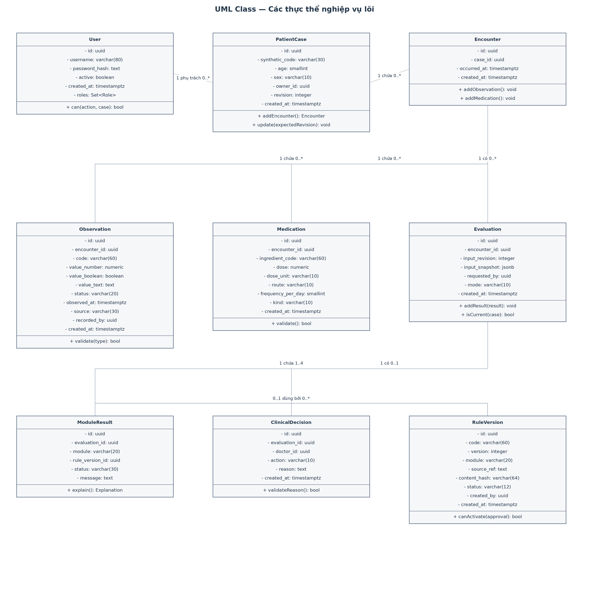
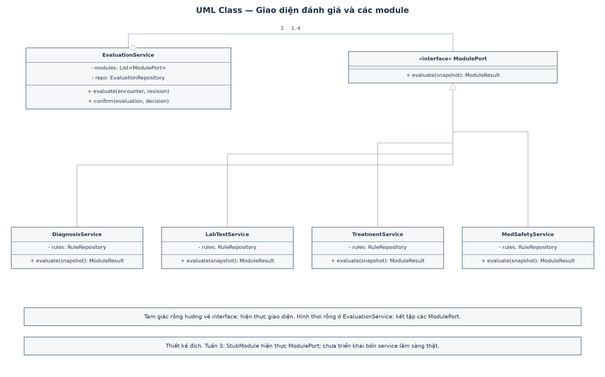
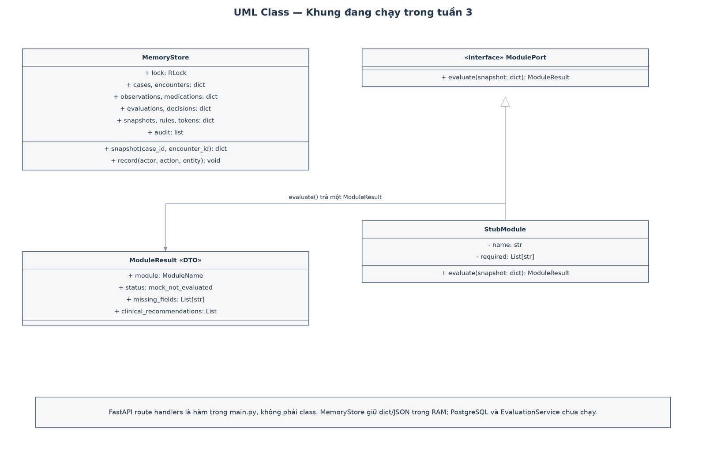
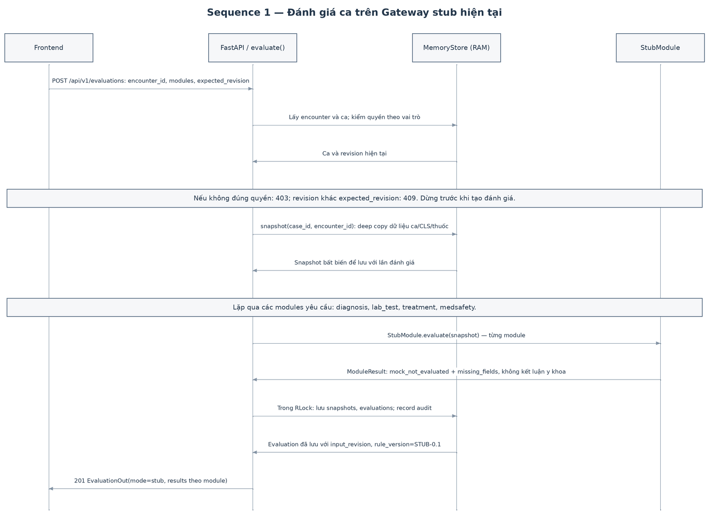
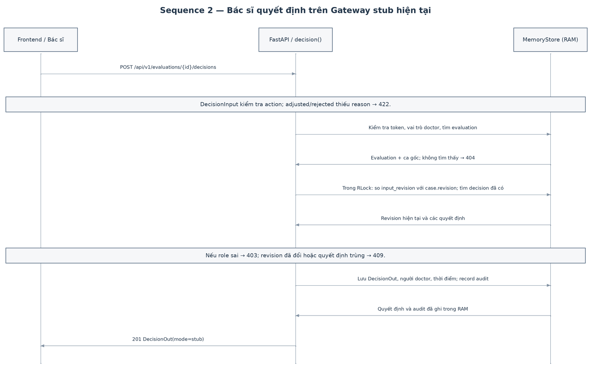
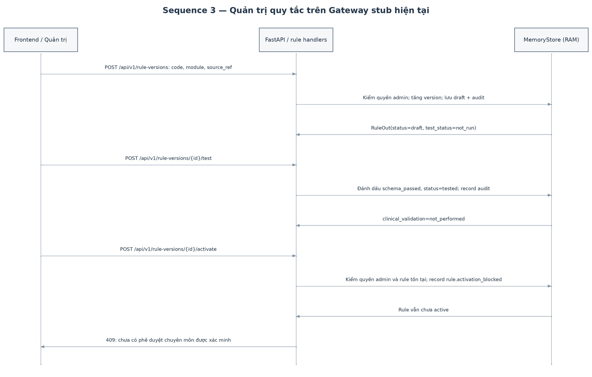

# UML tuần 3

## Class Diagram — hai mức cần phân biệt

**Hình 05: thiết kế miền nghiệp vụ dự kiến.** Các lớp quản lý ca bệnh, dữ liệu, phiên bản và quyết định. Quyền bác sĩ được kiểm tra trước khi tạo ClinicalDecision; Evaluation lưu dấu phiên bản đầu vào. Các lớp và phương thức trong hình này là thiết kế cho giai đoạn triển khai tiếp, chưa phải các class đang chạy trong Gateway.

**Hình 06: thiết kế dịch vụ dự kiến.** EvaluationService điều phối bốn cổng module, về sau có thể gọi các dịch vụ riêng theo C2. Hiện chỉ có `ModulePort` và `StubModule` hiện thực. Không tạo kế thừa giữa bác sĩ/dược sĩ/quản trị vì một tài khoản có thể có nhiều vai trò.

**Hình 11: đối chiếu với mã tuần 3.** `MemoryStore` lưu các dict trong RAM, `StubModule` kế thừa cổng trừu tượng `ModulePort` và trả `ModuleResult`. Các route của FastAPI hiện là hàm trong `main.py`, không phải một class Gateway. Các DTO Pydantic nằm trong `models.py`. Nhóm có thể chỉ vào hình này và ba tệp mã đó khi thầy hỏi đã hiện thực tới đâu.

## Sequence 1 — Đánh giá ca

UC-03–06, FR-07–22/24. **Luồng đang chạy:** `main.py` kiểm quyền và `expected_revision`; dưới `RLock`, `MemoryStore.snapshot()` sao chép dữ liệu; mỗi module được yêu cầu chạy `StubModule.evaluate()`; đánh giá, snapshot và audit được ghi RAM. Thiếu trường được trả trong `missing_fields`, không tự đổi thành 0; dữ liệu đổi phiên bản trả 409. Chưa có lời gọi tới Core hoặc cơ sở dữ liệu thật.

## Sequence 2 — Xác nhận quyết định

UC-07, FR-23–24. **Luồng đang chạy:** `DecisionInput` kiểm tra lý do nếu điều chỉnh/từ chối; route `decision()` kiểm vai trò doctor, quyền ca, revision và quyết định trùng, rồi lưu quyết định + audit trong `MemoryStore` dưới `RLock`. Khi nối PostgreSQL về sau cần transaction thực; lock RAM hiện chỉ dùng trong một process.

## Sequence 3 — Vòng đời quy tắc

UC-09, FR-27. **Luồng đang chạy:** quản trị tạo bản nháp, chạy test cấu trúc và có thể thử kích hoạt. `activate()` luôn trả 409 và ghi audit do chưa có luồng duyệt chuyên môn được xác minh. Test cấu trúc không đồng nghĩa xác nhận y khoa. Bảng `rule_approval` và guard trạng thái trong schema là thiết kế đích; Gateway chưa sử dụng. Quản trị chưa có endpoint tự đặt `approval_ref`.

Ba Sequence Diagram 07–09 mô tả **bản chạy tuần 3**, còn hình 05–06 mô tả **thiết kế dự kiến**. Ô ghi chú trên Sequence nêu điều kiện và nhánh lỗi; thông điệp thành công chỉ chạy nếu điều kiện cho phép. Nguồn chỉnh sửa là `../architecture/So_do_tuan3.drawio` và từng tệp `.drawio` trong `../architecture/`.

## Sơ đồ UML bổ sung để review

- [Class Diagram cho bệnh nhân cao tuổi và hỗ trợ suy tim](../architecture/12-class-hf-elderly.drawio): 3 trang, gồm dữ liệu đầu vào, module/kết quả và quyết định bác sĩ. PNG: [trang 1](../architecture/12-class-hf-elderly-01-quan-ly-benh-nhan-du-lieu-dau-vao.png), [trang 2](../architecture/12-class-hf-elderly-02-module-ket-qua-ho-tro.png), [trang 3](../architecture/12-class-hf-elderly-03-quyet-dinh-bac-si-quan-ly-ket-qua.png).
- [Sequence Diagram cho các luồng giả lập](../architecture/13-sequence-hf-elderly.drawio): 7 trang SD-01–SD-07. PNG được đặt cùng thư mục với tên bắt đầu bằng `13-sequence-hf-elderly-`.

Hai bộ bổ sung này là sơ đồ thiết kế để review; chúng chưa thay thế các hình 05–11 mô tả phạm vi tuần 3 hoặc chứng minh Gateway hiện đã triển khai các lớp và luồng trong hình.
